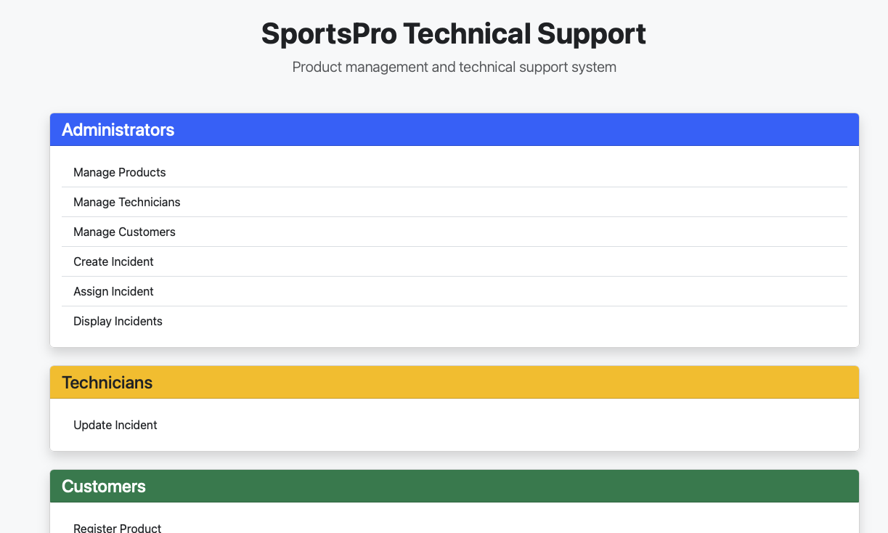
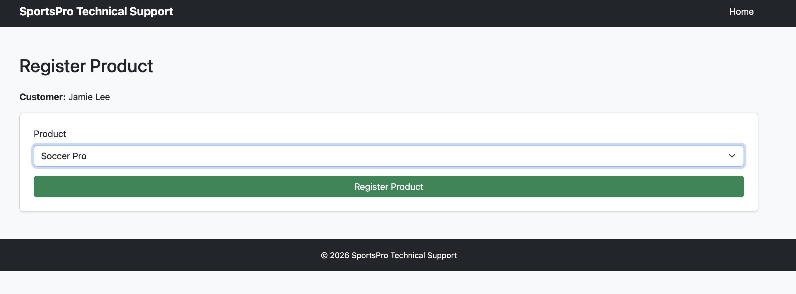
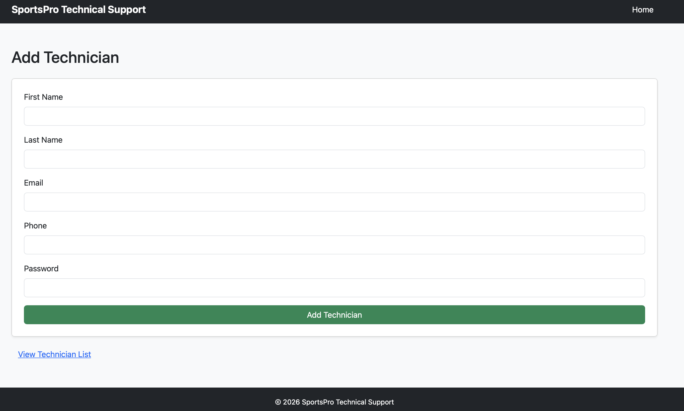
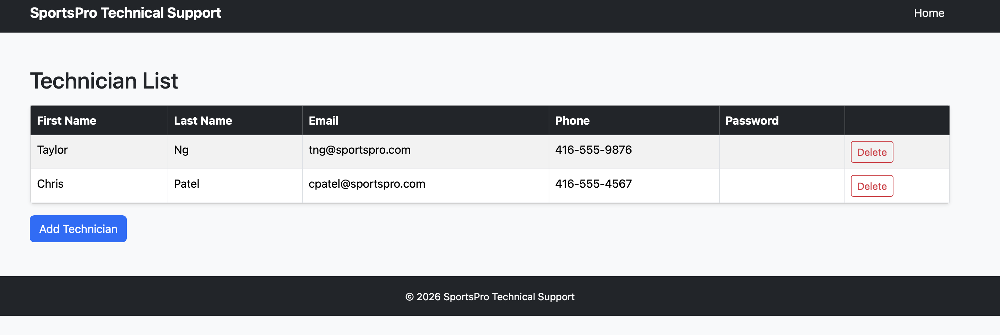
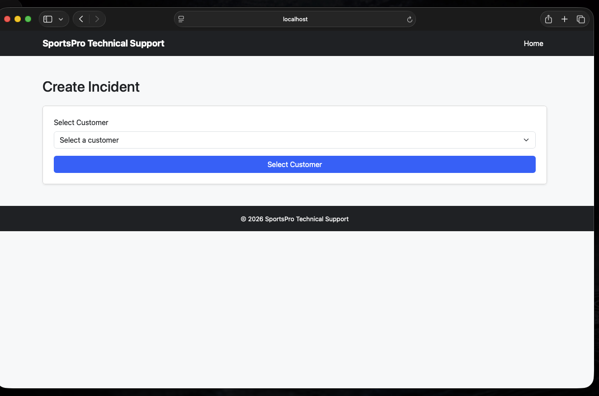
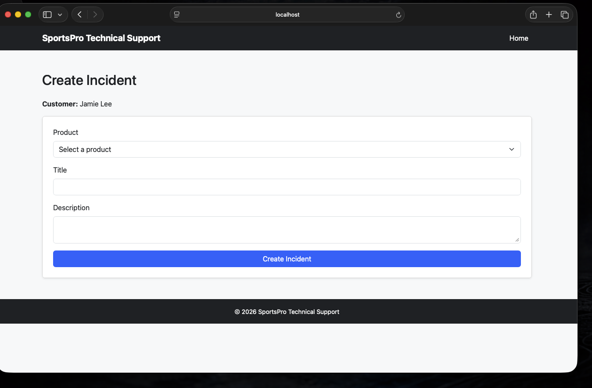
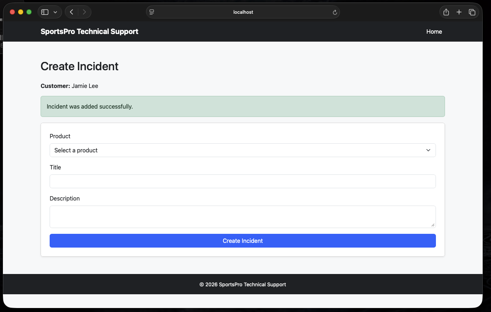

<<<<<<< HEAD
# SportsPro Technical Support

PHP/MySQL application for managing products, technicians, customers, and product registrations.

## Features

## Requirements

## Setup (XAMPP)

1. Copy the project into XAMPP:
	- `/Applications/XAMPP/xamppfiles/htdocs/SportsPro`
2. Create/import the database and tables.
3. Update DB credentials in [models/database.php](models/database.php) if needed.
4. Start Apache and MySQL in XAMPP.
5. Open: `http://localhost/SportsPro`

## Database

## Screenshots

>>>>>>> ccfc11d (Agregar screenshots y actualizar README.md)
